# Express的使用

## （参考网站[Express 4.x API 中文手册](Express 4.x API 中文手册)）

## 一、全局安装Express

```
sudo -s npm install express -g
```

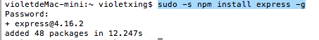

### 1、输入express报错

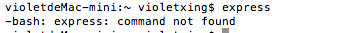

### 2、寻找解决方法

找到这篇[NodeJS Express安装后出现command not found问题](http://blog.csdn.net/dracotianlong/article/details/39394849)

在终端输入

```
sudo -s npm install -g express-generator
```

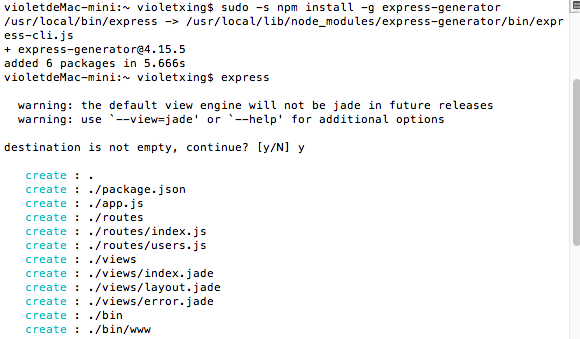

这就是安装成功

由于创建了空的文件夹，需要删除一些空的文件夹

```
rm -r 文件夹
```

```
rm 文件
```

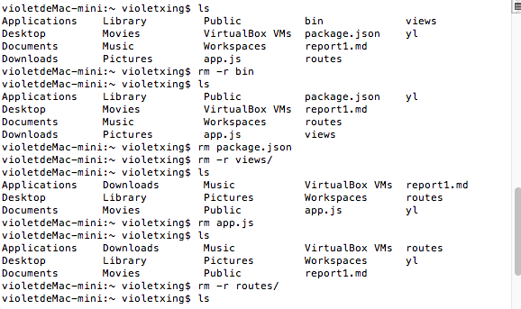

## 二、使用express创建项目

```
express -e 文件名字
```

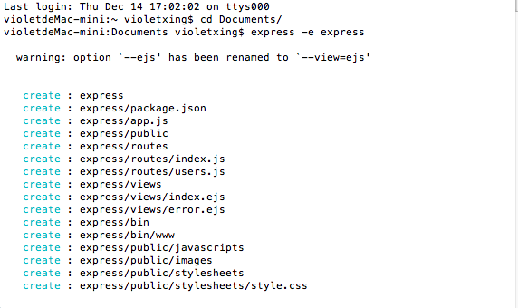

安装依赖并启动项目

```
npm install
```

```
npm start
```

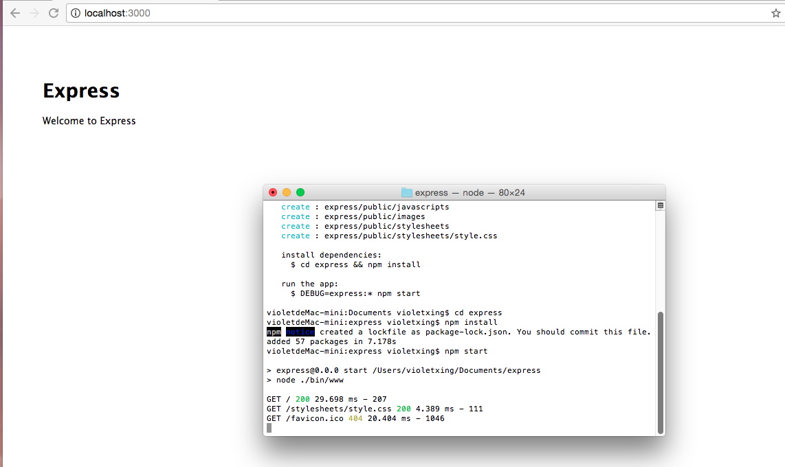

## 三、express具体作用

### 1、文件具体作用

1.<b>express/bin/www</b>是项目的启动文件

2.<b>public</b>里面放的是静态文件,如images图片，javascripts,stylesheets

3.<b>node_modules</b>里面放的是依赖文件

4.<b>route</b>存放路由

5.<b>views</b>存放html视图文件

### www文件作用

#### 1、端口号

```javascript
var port = normalizePort(process.env.PORT || '3000');
```

<b>3000</b>是端口号，可以自己改变

#### 2、服务器

```javascript
var server = http.createServer(app);
```
引入http模块，并创建服务器

#### 3、监听端口

```javascript
server.listen(port);
```

### 3、修改视图引擎

把views/error.ejs和views/index.ejs的后缀名都改为html，运行项目成功，但是访问页面出错

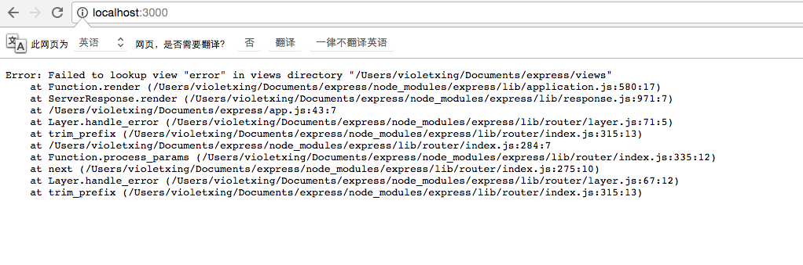

经过检查后发现，没有定义html的引擎。在[express官方文档](http://www.expressjs.com.cn/4x/api.html)找到解决方法：

点击右侧的app engine:

```javascript
app.engine('html', require('ejs').renderFile);
```
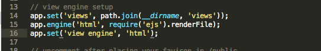

修改完成后重启项目再打开页面

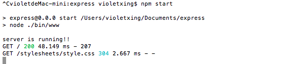

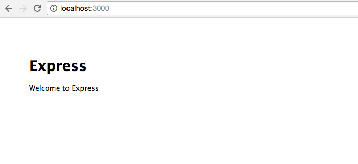

### 4、增加路由

express的框架文件存放在其项目下的`routes`文件里,在routes文件里有index.js和users.js两个文件。
要加入路由需修改`user.js`:

```javascript
router.get('/login', function(req, res){
	res.send("有这个路由");
```

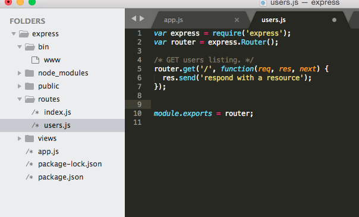

增加这句：

```javascript
//登陆页面的路由
router.get('/login', function(req, res){
	res.send("有这个路由");
});
```
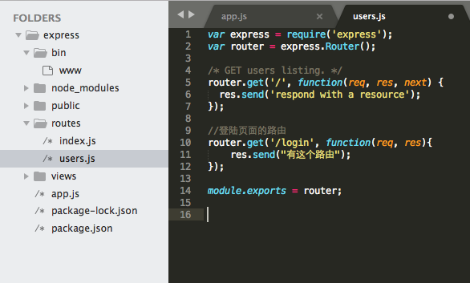

访问页面：

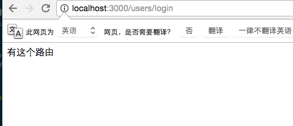

为请求返回html页面

```javascript
router.get('/admin',function(req,res){
	res.render('bootstrap2');
});
```
就可以把做好的bootstrap2.html文件导入到页面中

### 5、在主页添加链接

#### 为html文件添加路由


在`index.html`里增加

```javascript
<a href="users/admin">bootstrap2</a>
```

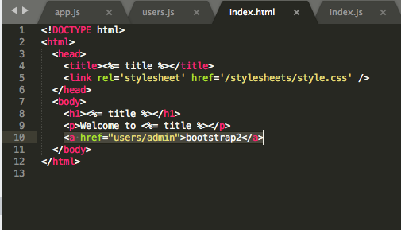

### 6、修改title

在index.js里可以修改title

```javascript
router.get('/', function(req, res, next) {
  res.render('index', { title: 'Violet' });
});
```
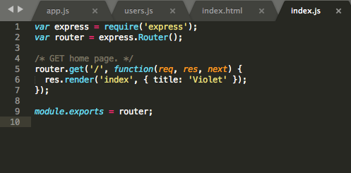

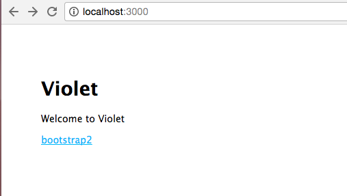


